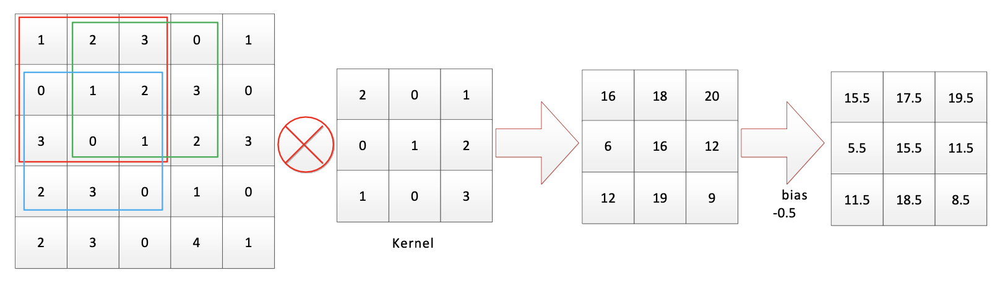
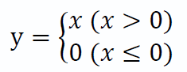
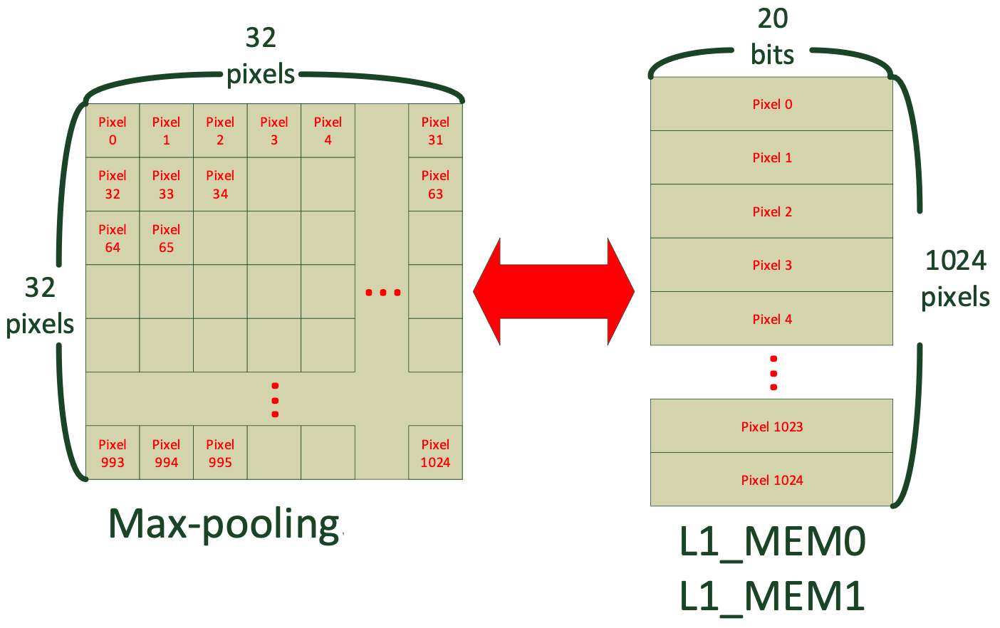
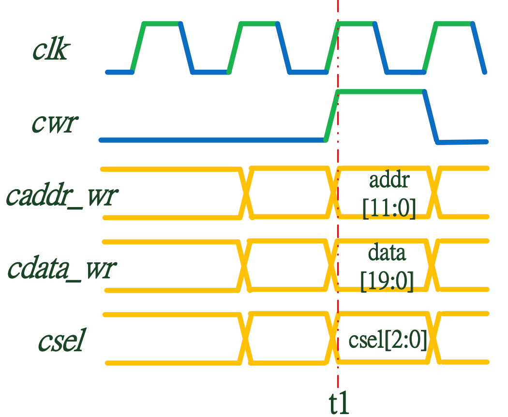

# 2019 CIC Contest Preliminary - Image Convolutional Circuit Design

# **1. Introduction**

Design an image convolutional circuit (CONV circuit) which is able to the computations of convolutional layer(layer 0), max-pooling(Layer 1), flattern(layer 2), besides, the input is gray image. The block diagram is demonstrated below.

First of all, in Layer 0, the input gray image which size is 64x64 has to be padding with zeros, afterwards, convolves with two different kernels which both size are 3x3. The, the results, two 64x64 size feature maps, are calculated followed by ReLU activation.
Secondly, Layer 1 compute the maximum pooling function where the kernel chooses 2x2 and stride is selected as two. Therefore, the results in this layer produce two 32x32 feature maps.
Last, Layer 2 flatterns the feature maps after max-pooling that the final result will expand to a length of 2048 serial signals in this design and output to memory.
Besides, the results for each layer are writen to the built-in memories in texture.v that are L0_MEM0, L0_MEM1, L1_MEM0, L1_MEM1 and L2_MEM, the testbench verifies results in the memories.
  
# **2. Specification**
## 2.1 System Block diagram

## 2.2 Signal Description
| Signal Name | I/O | Width | Description |
|:---:|:---:|:---:|:---|
|    clk      |  I  |   1   | System clock that all signals are related to rising edge of clk.       	 |	  
|    reset    |  I  |   1   | System reset that actives high asynchronously. 							 | 
|    ready    |  I  |   1   | Ready signal indicates the input gray image is already provided. When ready is asserted, CONV circuit can start requesting image data via sending address. |
|    busy     |  O  |   1   | Busy signal is asserted while CONV circuit recives ready as HIGH and prepares to work. It disassertes after all the related computations are done. |
|    iaddr    |  O  |  12   | Address to request input gray image. 										 |
|    idata    |  I  |  20   | A sign input pixel data of gray image that constitutes 4-bit MSB as integer and 16-bit LSB as fraction. |
|     crd     |  O  |   1   | Read enable signal indicates that the CONV circuit starts reading data from the memory when it is asserted. |
|   cdata_rd  |  I  |  20   | Pixel data formed as 4-bit MSB integer and 16-bit LSB fraction inputs from the memory. |
|   caddr_rd  |  O  |  12   | Memory address associates the pixel data in the memory. |
|     cwr     |  O  |   1   | Write enable signal indicates that the CONV circuit starts writing the results to the memory when it is asserted. |
|   cdata_wr  |  O  |  20   | Result data formed as 4-bit MSB integer and 16-bit LSB fraction outputs to the memory. |
|   caddr_wr  |  O  |  12   | Memory address associates the results to be written and stored in the memory. |
|     csel    |  O  |   3   | Memory selection signal that CONV circuit chooses which memory to read/write according to it.\
|             |     |       | 3'b000: no selection.
|             |     |       | 3'b001: read/write the layer 0 results convolved with kernel 0.
|             |     |       | 3'b010: read/write the layer 0 results convolved with kernel 1.
|             |     |       | 3'b011: read/write the layer 1 results convolved with kernel 0.
|             |     |       | 3'b100: read/write the layer 1 results convolved with kernel 1 and computed max-pooling afterwards.
|             |     |       | 3'b101: read/write the layer 3 results which is flatterned. |

## 2.3 Functional Description
After reset, testfixture asserts ready signal to indicate that data with repect to the gray images and kernels are already prepared. CONV circuit has to assert busy signal (shown at t1) so that the testfixture disasserts ready after detects bust as HIGH in order to wait for CONV circuit execution (shown at t2).
Furthermore, CONV circuit restores busy as LOW either while all tasks have done or the excution of desired layer is done (shown at t3), meanwhile, testfixture is going to prepare next image and assert ready signal. Besides, testfixture starts verification when detects the busy signal setting to LOW again; CONV circuit is only admitted to assert busy signal once with respect to each one input image, and the CONV circuit only disasserts busy once in the end of computation. In addition, during the process when busy is asserted HIGH, CONV circuit is permitted to read/write all the memories without times limitation.

  \
  \
  \

1. Input gray image is formed as 64x64x1 pixels which is stored in the memory in testfixture, the way of the memory to store data is shown below.

CONV circuit sends iddr signal to request data, further, the testfixture responses idata corresponding to the address at the falling edge which are shown at t1 and t2.

2. Layer 0 computes the convolutional processing on input image after zero-padding with kernel 0 and kernel 1 seperately. Subsequently, obtain the results from the ReLU activation computation on each pixels.\
  
	A. Convolutional.\
		Map the 3x3 kernel values on the input image, then compute the multiply-accumilate operation and move fixed 1 stride step by step as the figure shown below. For instance, on the red square we get 1x2 + 2x0 + 3x1 + 0x0 +1x1 + 2x2 + 3x1 + 0x0 + 1x3 = 16. After that, move right by one stride as the green square shown and get the result of 18. Finally, the entire feature map is calculated and plus the bias -0.5.

.\
.\
		The weight values on kernel 0 and kernel 1 are given as shown below. The upper figure shows decimal velue with weights, meanwhile, the lower gives hexadecimal values formed as 4-bit integer plus 16-bit fraction. 

.\
.\
	B. Zero-padding.\
		In most cases, a convolution reduces the size of original image. However, the size can be preserved when pad zeros on the original image prior to the convolution. In this design, the input image has to be padded zero with one pixel surrondingly as shown as the figure below.

.\
.\
	C. ReLU.\
		ReLU (Rectified Linear Unit) can be expressed as the equation. Output y reduces to 0 if the input is equal to and less than 0, while the output y remains original value if the input is larger than 0.\

.\
.\
	D. 
		CONV circuit is responsible for sending the results from Layer 0 to the testfixture with respect to the address cdata_wr and the data cdata_wr. Furthermore, Each feature map has the specific memory so the circuit has to select _csel_ signal as 4'b001 and 3'b010 to store eitht kernel 0 or kernel respectively. The storage structure is shown as below where the data width among L0_MEM0 and L0_MEM1 is 20 bits; 4-bit integer plus 16-bit fraction. Note that the data has to be rounding. 
\
.\
3. Layer 1 processes the max-pooling which shrinks the size of the result from convolution, i.e. down-sampling. CONV circuit uses 2x2 max-pooling so the size shrinks to the half of original result.\
Compute the max-pooling with the two convolution results, therefore, the two 64x64 results becomes two 32x32 feature maps as the figure shown. In detail, it chooses the maximal value in the 2x2 window size, and moves from the upper left to lower right at stride 2. For instance, the value is chosen 7 in the yellow region, while the value is chosen 7 in the blue region after moves 2 stride.

\
CONV circuit sends two results after max-pooling to testfixture with respect to the address caddr and the data cdata. The _csel_ has to select 3'b011 or 3'b100 to choose the specific either L1_MEM0 or L1_MEM1, respectively. The fiure below shows the way of store.

\
.\
4. Layer 2 is flattern computation. CONV circuit has to flattern two 32x32 results into a length of 2048 vector in the intersectional order between kernel 0 and kernel 1 as the figure shown below. After that, CONV circuit sends the 2048 pixels to the memory in the testfixture with respect to the address caddr and the data cdata.
/
.\
.\
.\
## 2.4 Behaviour of memories
The behaviour among L0_MEM0, L0_MEM1, L1_MEM0, L1_MEM1 and L2_MEM are the same SRAM models, the control manner and timing are the same and are capable of read and write. It uses _csel_ control signal to select different memories and uses _cwr_ as write enable, crd as read enable.\
When read, use _caddr_rd_ as the address and cdara_rd as the data signal. The behaviour is shown below, _cdata_rd_ reads data according to the address _caddr_rd_ when _crd_ is observed HIGH at falling clock edge as shown at t1.
\
.\
When write, use _caddr_wr_ as the address and _cdata_wr_ as the data signal. It writes _cdata_wr_ into memory according to the address _caddr_wr_ when _cwr_ is observe HIGH at rising clock edge as shown at t2.
\

